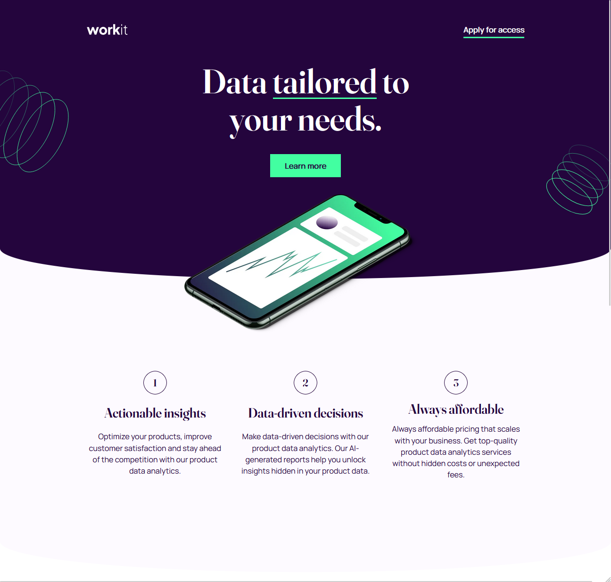

# Frontend Mentor - Workit landing page solution

This is a solution to the [Workit landing page challenge on Frontend Mentor](https://www.frontendmentor.io/challenges/workit-landing-page-2fYnyle5lu). Frontend Mentor challenges help you improve your coding skills by building realistic projects.

## Table of contents

- [Frontend Mentor - Workit landing page solution](#frontend-mentor---workit-landing-page-solution)
  - [Table of contents](#table-of-contents)
  - [Overview](#overview)
    - [The challenge](#the-challenge)
    - [Screenshot](#screenshot)
    - [Links](#links)
  - [My process](#my-process)
    - [Built with](#built-with)
    - [What I learned](#what-i-learned)
    - [Continued development](#continued-development)
    - [Useful resources](#useful-resources)

## Overview

### The challenge

Users should be able to:

- View the optimal layout for the interface depending on their device's screen size
- See hover and focus states for all interactive elements on the page

### Screenshot

### Links

- Live Site URL: https://soft-taffy-d44234.netlify.app/

## My process

### Built with

- Semantic HTML5 markup
- CSS custom properties
- Flexbox
- CSS Grid
- Mobile-first workflow
- Container queries
- Fluid typography & spacings

### What I learned

- Layout for the "About" section: since I am actively trying to use less and less media-queries for layouts the challenge here was how the center the image on mobile and position it around the top left of the card for bigger screen widths. My first thought was to place the image in relation to the card, but the card also is restricted by fixed max-width. I therefore had an idea to use `display: inline-block` for the image so that it gets centered automatically on mobile due the `text-align: center` i set on the section element.
- Curved edges: tried to act smart by using anchor positionings in combination with data-attributes to anchor a pseudo-element to the corresponding section... kind of overengineered and decided to keep it simple with position `relative` + `absolute` pattern.
- Features section: had the chance to use the "Switcher" layout pattern on parent container keeping it fluid from 3 columns to 1 column. In addition to that, used grid layout for the child elements to position the number, heading and description combo (had to use container queries to change layouts for tablet view...)

### Continued development

Some improvements that could be made:

- refactor HTML: keep it clean and remove "wrapper" elements somehow, see Kevin powell video
- improve the features section layout switch: there are some magic numbers used as "sweet spots"
- about image portrait: needs some adjustments to look like the one in the design

### Useful resources

- [Switcher layout](https://every-layout.dev/layouts/switcher/) - great book btw!
- [Content Grid Wrapper](https://youtu.be/c13gpBrnGEw?si=BNg4gFtVUhu2t7vg) - will need this for the refactoring
